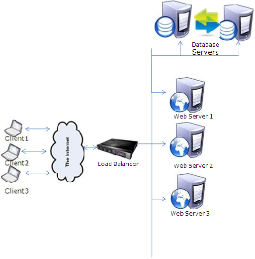
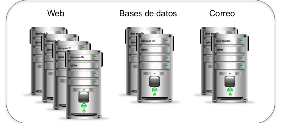

# Tema 1. Introducción

Para empezar la asignatura vamos a suponer que hemos terminado la carrera, estamos trabajando y una empresa nos ha pedido que realicemos el despliegue de un servidor web. Entonces tenemos 2 opciones:

- Trabajar mucho al inicio y tras esto vivir después sin preocupaciones
- Empezar de manera rápida siendo necesario  de manera obligatoria el mantenimiento y mejora de este

Para empezar el planteamiento necesitaríamos:
- Montar un servidor en una máquina
- Adquirir un segundo servidor para desarrollo y testeo del servidor
- Segundo servidor para sustituir el principal debido a cualquier percance de la primera

Otra opción sería realizar una **Granja Web**.

Para entenderlo mejor, existe un balanceador de carga y puede darse el aso que cada servidor este destinado a una cosa específica, como uno estático, otro de gestión de BD...

## Conceptos básicos

En cada uno de esos grupos de máquinas se puede instalar diferente tipo de aplicaciones, como he dicho anteriormente, siendo cada uno de esos más eficiente para un tipo de servicio.

## Un sitio web mal planificado

Este ejemplo sería debido a querer realizar el trabajo de manera rápida y con el menor coste posible, realizando la instalación de todos los servicios en una sola máquina.

Esto lo malo que se sobrecargaría el servidor cuando empiece a atender más solicitudes. Esto daría lo mismo que tuviesemos la mejor máquina, ya que habrá un punto que esta no pueda realizar las respuestas.

En este caso es que es muy fácil y rápido de montar en una máquina.

Al final tarde o temprano el hardware falla, por lo que lo suyo es tener un sustituto, que tiene que ser identico al master.

Pero esto es injusto ya que tenemos dos buenas máquinas y solo una de ellas está trabajando, la otra unicamente es una copia, por lo que lo suyo sería que la carga estuviese dividida entre los dos.

Un ejemplo real fue en el caso de la UGR, que hay 2 nodos, uno maestro y otro esclavo. Esto es debido a que si se cae el nodo maestro, se le puede asignar al esclavo que pase a ser maestro.

## Un sitio web de éxito

Lo suyo sería hacer  una estructura más compleja, y más segura.

Esto se agradece ya que es escalable y tiene una alta disponibilidad, pero lo malo es la complejidad en la instalación y configuración de esta. Está orientado a dar servicio a millones de usuarios. Si es para una página web pequeñita no es necesario.