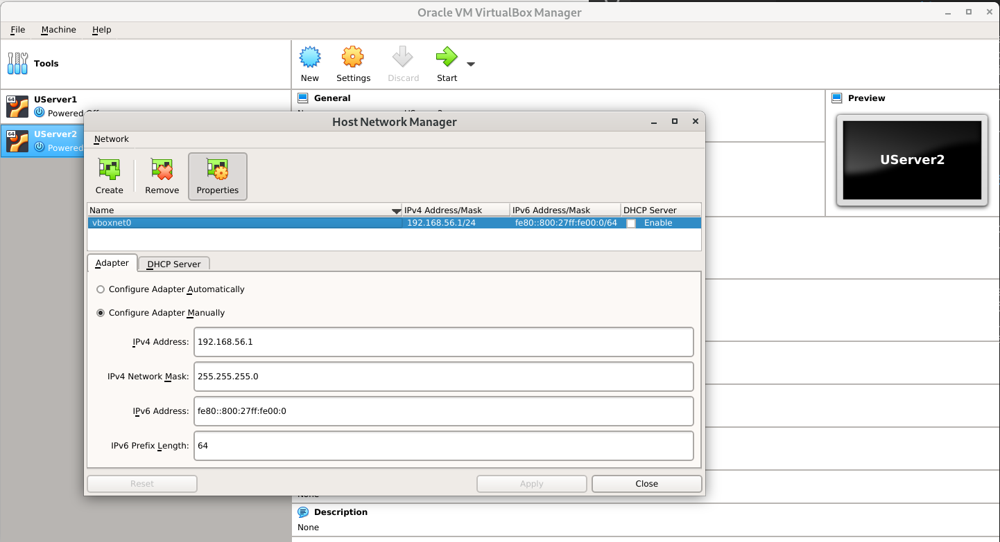
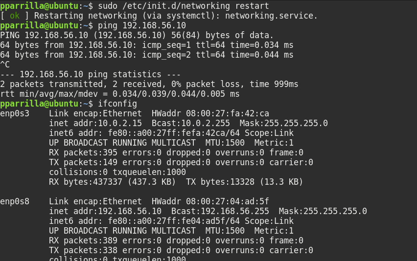
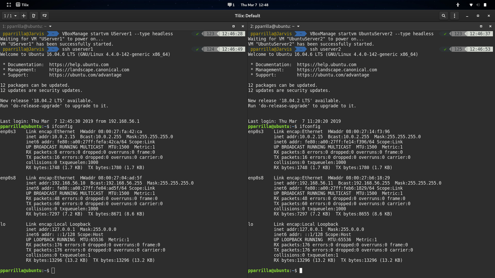
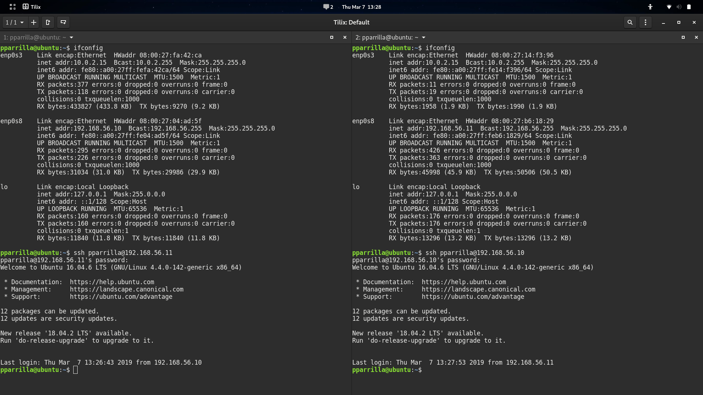
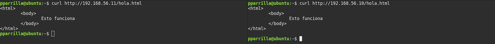
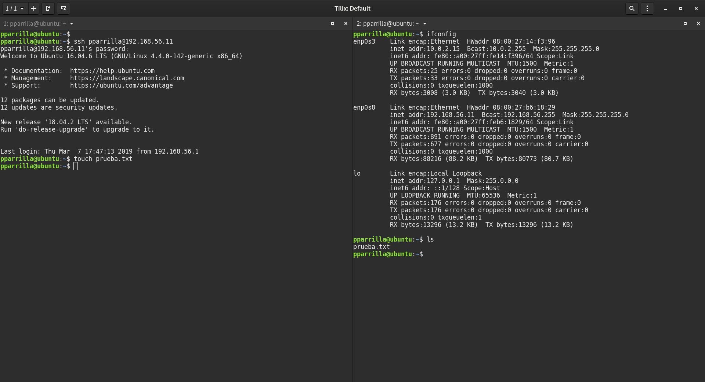

# Práctica 1. Preparación de las herramientas

## Introducción

En esta práctica vamos a realizar la instalación de Ubuntu Server en una Máquina Virtual. Además, hay que llevar a cabo las siguientes tareas:
1. Acceder por ssh de una máquina a otra
2. Acceder mediante la herramienta curl desde una máquina a otra
Por los trabajos necesarios a realizar, necesitamos hacer 2 máquinas con el software solicitado. En mi caso estoy utilizando VirtualBox.

## Proceso de instalación

Como viene explicado en el guión de prácticas entregado por el profesor, es necesario en el Ubuntu Server instalar los siguientes paquetes:
- OpenSSH server
- LAMP server

Una vez realizada la instalación de las máquinas, he realizado una conexión con el Host de estas, para ello es necesario un host network manager, mostrado en la siguiente imagen:

Para realizarlo, en VirtualBox se le da a File, Host Network Manager..., creamos uno y en dhcp server deseleccionamos enable server.

Como se puede observar, tiene el DHCP Server estático para configurar nosotros la ip de la máquina. Tras esto le añadimos el adaptador en la configuración:

Tras esto la arrancamos y añadimos al final del archivo `/etc/network/interfaces` lo siguiente:
```bash
# The secondary network 
auto enp0s8
iface enp0s8 inet static
address 192.168.56.10 #La otra será la ip 192.168.56.11 por ejemplo
netmask 255.255.255.0
```
Por último quedaría ejecutar el comando para resetear la red y comprobar que funciona correctamente:


## Preparación para conexión ssh

Una vez hecho lo anterior en las dos máquinas, queda realizar la conexión entre ellas. En mi caso para no tener que estar utilizando la interfaz de VirtualBox directamente, me he conectado mediante ssh a cada máquina como se puede comprobar en la siguiente captura de pantalla:


Para que la conexión sea tan cómoda he tenido que modificar el `~/.ssh/config` añadiendo el siguiente texto:
```bash
Host userver1
    HostName 192.168.56.10
    User pparrilla
```

Además, ejecuté el comando `ssh-copy-id userver1` tras la modificación del archivo anterior, para que no me pidiese más la contraseña al conectarme a esa máquina.

Por último queda realizar la comprobación de que se pueden conectar entre ellas.

## Conexión ssh y curl

Para conectarse de una máquina a otra, hay que seguir los siguientes pasos mostrados en la imagen:


En la parte derecha tengo la máquina 1 con la ip 192.168.56.10, y en la izquierda la 2 con ip 192.168.56.11, pudiendo verificarlo con el comando  `ifconfig`. 

La conexión curl sería para la obtención de un paquete de la otra máquina utilizando otro puerto (el 80 si utilizamos apache con http, la conexión ssh utiliza el 22). Para comprobar si funciona creamos el .html mencionado en el guión y nos lo descargamos:

El html de ejemplo es el siguiente:

```html
<html>
    <body>
        Esto funciona
    </body>
</html>
```

Obteniendo la siguiente captura:



Por solicitud del profesor para la práctica, adjunto otra captura mostrando el uso de touch para la verificación correcta del ssh.


