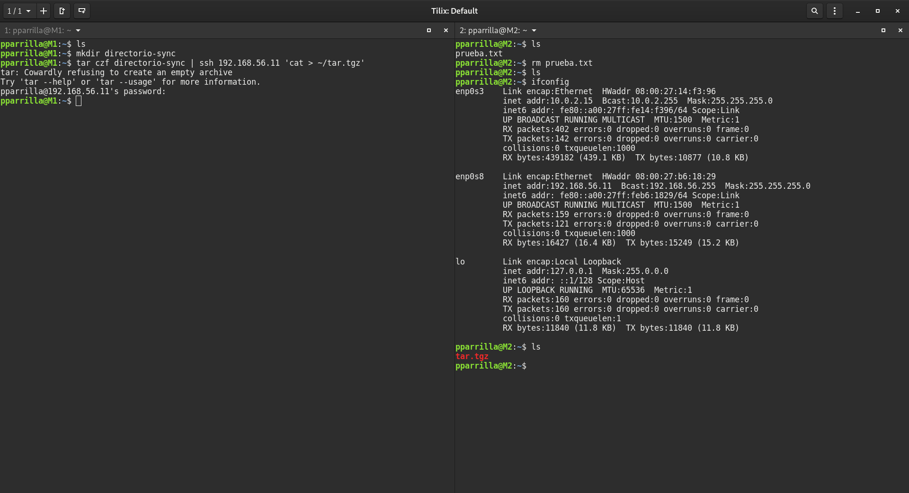
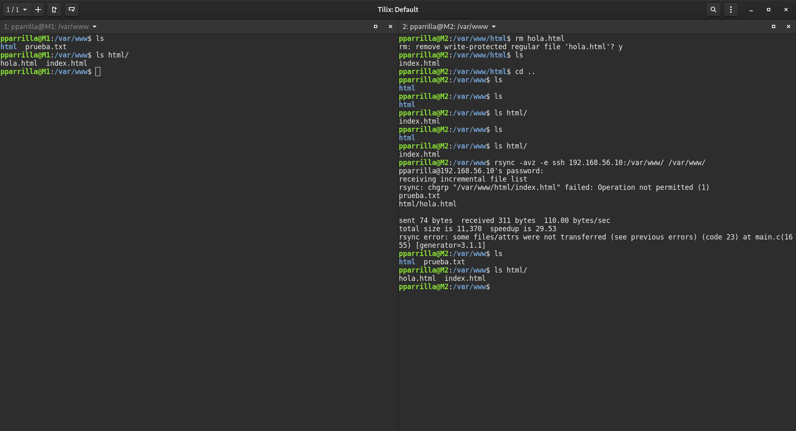
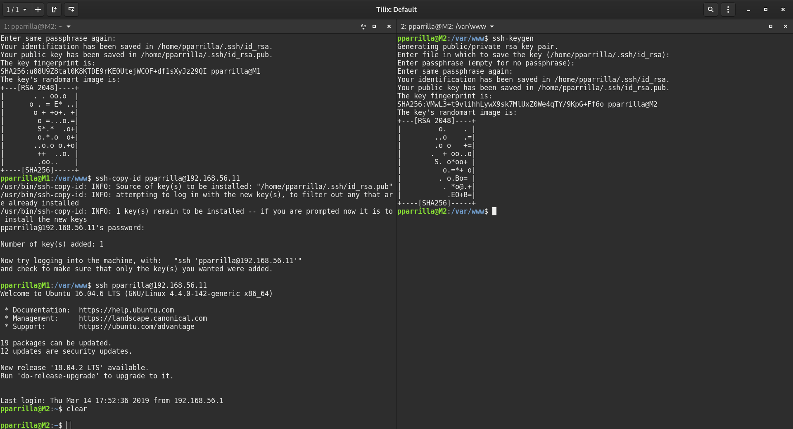
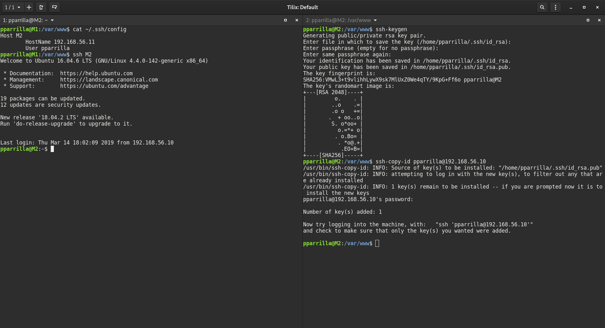

# Práctica 2. Clonar la información de un sitio web

## Objetivos de la práctica

Los objetivos concretos de esta segunda práctica son:
- Aprender a copiar archivos mediante ssh
- Clonar contenido entre máquinas
- Configurar el ssh para acceder a máquinas remotas sin contraseñas
- Establecer tareas en cron

### Ejercicio 1. Probar el funcionamiento de la copia de archivos por ssh

Para realizar una comprobación de copia de archivos ssh, realizo el comando indicado en el guión, como muestro en la captura de pantalla:



### Ejercicio 2. Clonado de una carpeta entre dos máquinas

Esto es útil en algún momento pero no servirá para sincronizar grandes cantidades de información, por lo que se va a usar rsync.

Para ello tenemos la opción de descargarlo de la página oficial ([http://rsync.samba.org/download.html](http://rsync.samba.org/download.html))

En Ubuntu está directamente en los repositorios por lo que ejecutamos `sudo apt-get install rsync`.

Como vamos a trabajar en modo usuario le damos permiso!s a la carpeta indicada para este caso, que es con el comando `sudo chown user:user /var/www`



Está la opción de que el comando rsync tenga más parámetros como en el siguiente ejemplo:

```bash
rsync -avz --delete --exclude=**/stats --exclude=**/error exclude=**/files/pictures -e ssh maquina1:/var/www/ /var/www/
```

### Ejercicio 3. Configuración de ssh para acceder sin que solicite contraseña

Para el acceso sin contraseña necesitamos generar las claves ssh de cada máquina y ejecutar lo indicado en la imágen:



Extra: Hay una forma de guardar la máquina a la máquina que te quieres conectar con un nombre, para no tener que acordarte de la ip. En la siguiente captura muestro un ejemplo



Modificamos el fichero `~/.ssh/config` y añadimos lo que he mostrado anteriormente, y ya podemos realizarlo.

### Ejercicio 4. Establecer una tarea en cron que se ejecute cada hora para mantener actualizado el contenido del directorio /var/www entre dos máquinas

Por último es necesario añadir a crontab cuando se va a realizar el comando para realizar la copia con rsync

