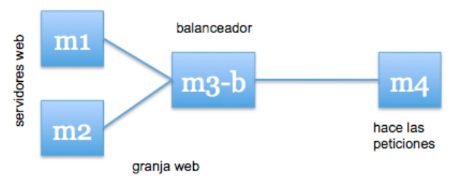
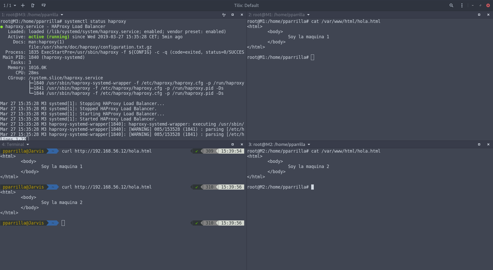
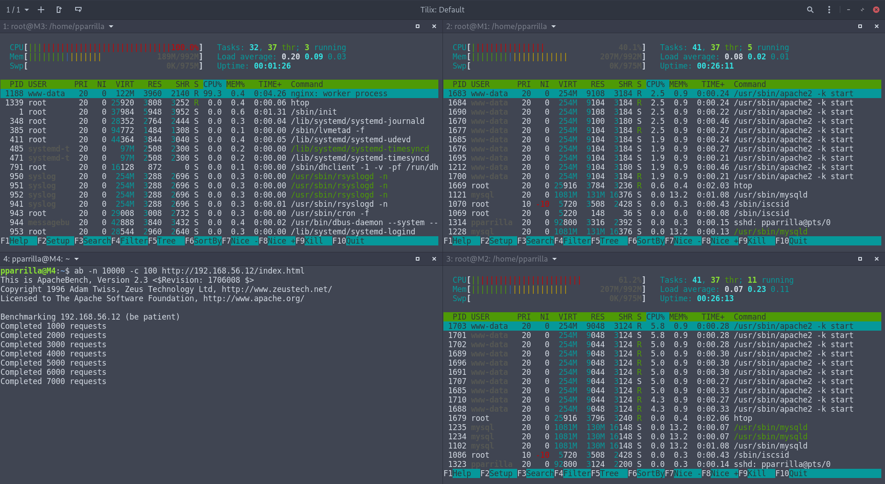
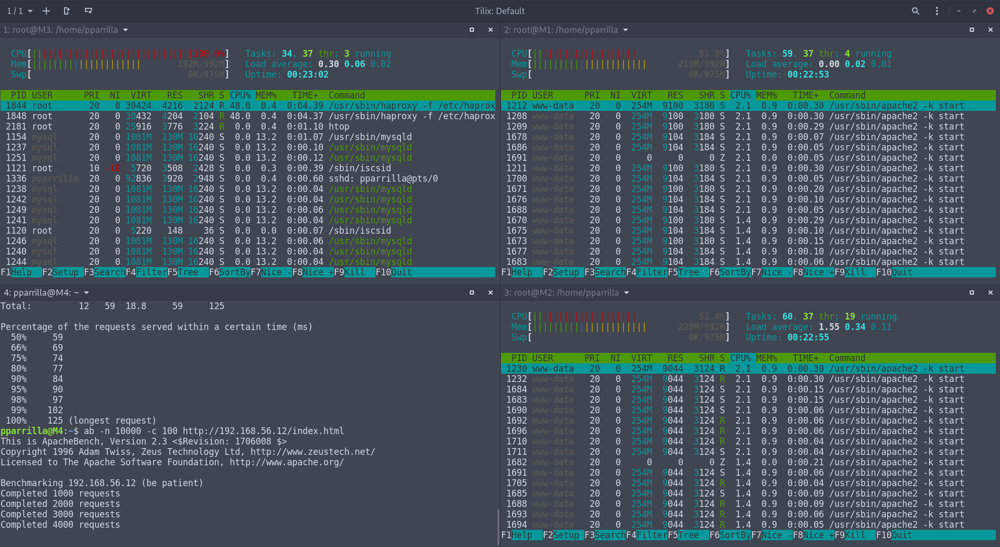

# Práctica 3. Balanceo de carga

## Objetivos de la práctica

En esta práctica configuraremos una red entre varias máquinas de forma qeu tengamos un balanceador que reparta la carga entre varios servidores finales. Como esta asignatura se centra en las tecnologías web, balancearemos los servidores HTTP que configuramos en la práctica anterior.

Al finalinar la práctica tendremos algo como lo siguiente mostrado en el diagrama:



## Uso de NGINX

Esta herramienta es la que usaremos para realizar la distribución de carga. A continuación adjunto una captura donde muestro el estado de las 3 máquinas (M1, M2 con apache2 y M3 con nginx):


Tras la instalación, vamos a configurar el fichero `/etc/nginx/conf.d/default.conf` donde tenemos instalado el servicio de nginx, añadiendo lo siguiente:
```bash
upstream apaches {
        server 192.168.56.10;   # Direcciones IP de nuestras máquinas
        server 192.168.56.11;   # En mi caso son esas
}
server{
        listen 80;
        server_name balanceador;
        access_log /var/log/nginx/balanceador.access.log;
        error_log /var/log/nginx/balanceador.error.log;
        root /var/www/;
        location /
        {
                proxy_pass http://apaches;
                proxy_set_header Host $host;
                proxy_set_header X-Real-IP $remote_addr;
                proxy_set_header X-Forwarded-For $proxy_add_x_forwarded_for;
                proxy_http_version 1.1;
                proxy_set_header Connection "";
        }
}
```
Realizamos `systemctl restart nginx` después de haber hecho los cambios

Tras realizarlo podemos probar en el host el funcionamiento accediendo desde firefox a la ip de la máquina que tiene el balanceador de carga:


Nota: He añadido *weight=1* y *weight=2* en los server para mandar el doble de peticiones a una que a otra ya que se puede asignar la carga.

## Uso de haproxy

Este es el otro programa que vamos a utilizar para el balanceo de carga. Para ello realizamos la instalación en la máquina 3 y modificamos el archivo `/etc/haproxy/haproxy.cfg`.

```bash
global
        daemon
        maxconn 256

defaults
        mode http
        contimeout 4000
        clitimeout 42000
        srvtimeout 43000

frontend http-in
        bind *:80
        default_backend servers

backend servers
        server m1 192.168.56.10:80 maxconn 32
        server m2 192.168.56.11:80 maxconn 32
```

Tras añadirlo hay que activarlo con el comando `sudo /usr/sbin/haproxy -f /etc/haproxy/haproxy.cfg`. Al ejecutarlo en la terminal muestra que esto funciona pero que en futuras versiones se le dejará de dar soporte.


A continuación incluyo la captura en la que está funcionando:



## Utilización del benchmark

Vamos a utilizar el benchmark de apache para probar el soporte del servidor web montado. Primero vamos a utilizar el nginx como distribuidor de carga. El comando para realizar las solicitudes de apache las vamos a realizar desde la máquina 4, con el comando `ab -n 10000 -c 100 http://192.168.56.12/index.html`

Aqui la captura de nginx mostrando el comando `htop` en las máquinas:


Hay que tener en cuenta que la máquina 2 se le mandan más solicitudes por la configuración que se ha realizado.

Por último la captura de haproxy al igual que en el caso anterior:

