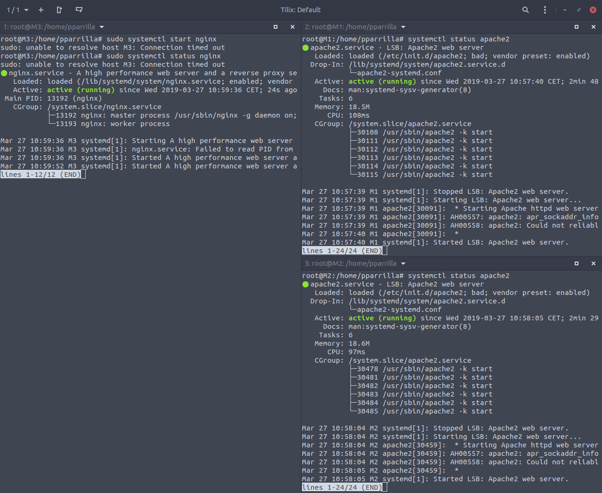

# Práctica 3. Balanceo de carga

## Objetivos de la práctica

En esta práctica configuraremos una red entre varias máquinas de forma qeu tengamos un balanceador que reparta la carga entre varios servidores finales. Como esta asignatura se centra en las tecnologías web, balancearemos los servidores HTTP que configuramos en la práctica anterior.

Al finalinar la práctica tendremos algo como lo siguiente mostrado en el diagrama:


## Uso de NGINX

Esta herramienta es la que usaremos para realizar la distribución de carga. A continuación adjunto una captura donde muestro el estado de las 3 máquinas (M1, M2 con apache2 y M3 con nginx):



Tras la instalación, vamos a configurar el fichero `/etc/nginx/conf.d/default.conf` donde tenemos instalado el servicio de nginx, añadiendo lo siguiente:
```bash
upstream apaches {
        server 192.168.56.10;   # Direcciones IP de nuestras máquinas
        server 192.168.56.11;   # En mi caso son esas
}
server{
        listen 80;
        server_name balanceador;
        access_log /var/log/nginx/balanceador.access.log;
        error_log /var/log/nginx/balanceador.error.log;
        root /var/www/;
        location /
        {
                proxy_pass http://apaches;
                proxy_set_header Host $host;
                proxy_set_header X-Real-IP $remote_addr;
                proxy_set_header X-Forwarded-For $proxy_add_x_forwarded_for;
                proxy_http_version 1.1;
                proxy_set_header Connection "";
        }
}
```
Realizamos `systemctl restart nginx` después de haber hecho los cambios

Tras realizarlo podemos probar en el host el funcionamiento accediendo desde firefox a la ip de la máquina que tiene el balanceador de carga:


Nota: He añadido *weight=1* y *weight=2* en los server para mandar el doble de peticiones a una que a otra ya que se puede asignar la carga.

## Uso de haproxy

