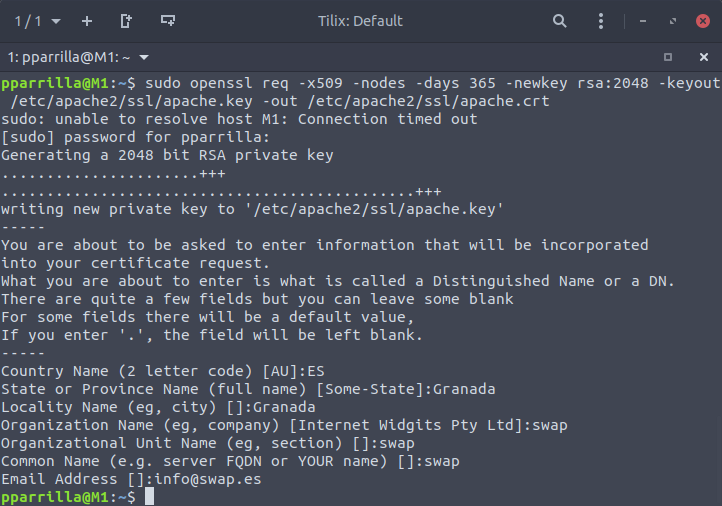
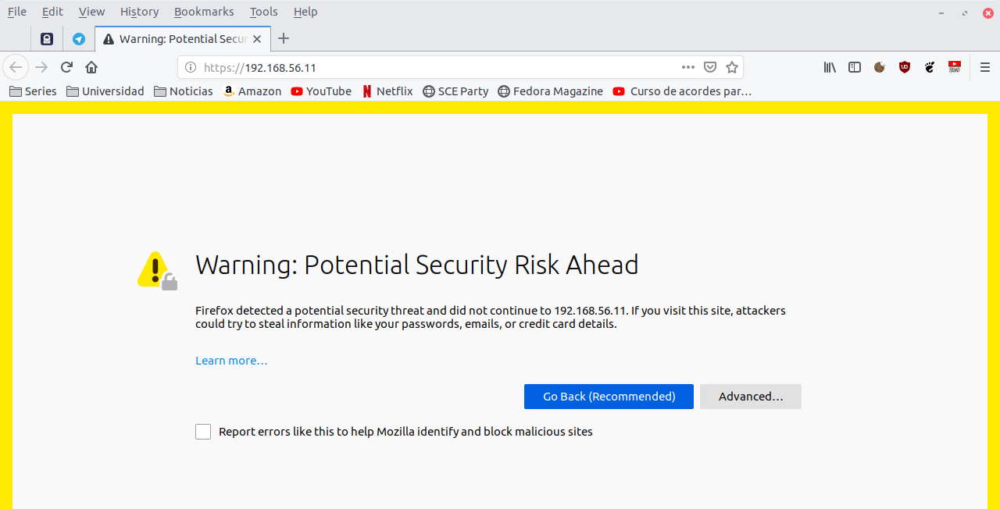
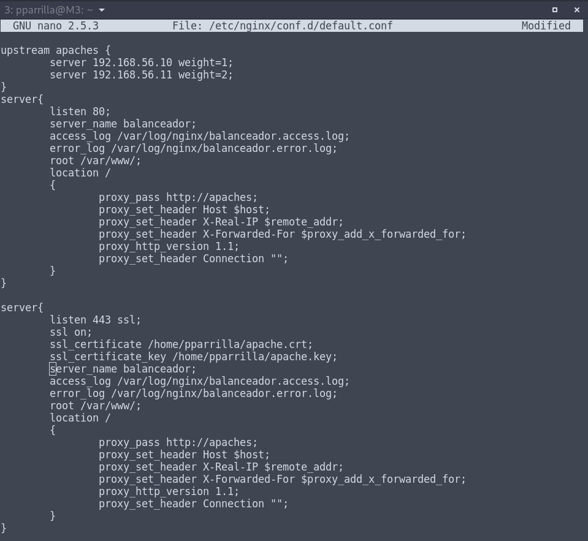
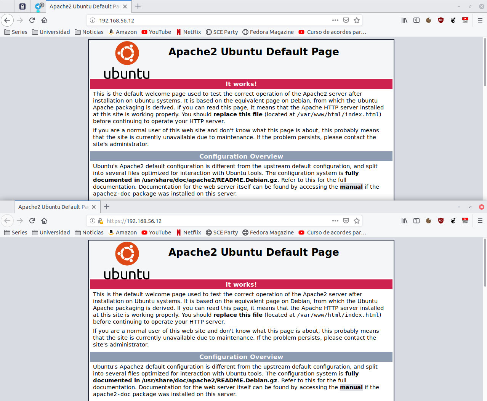
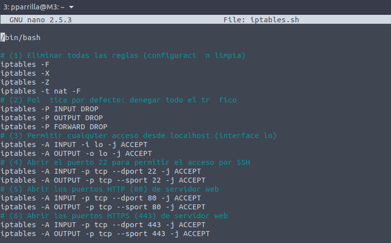
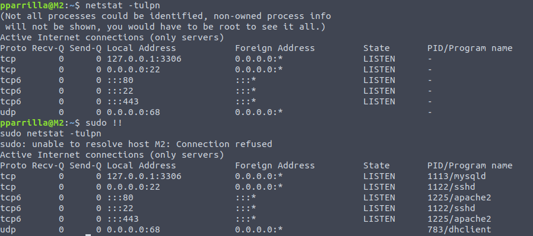
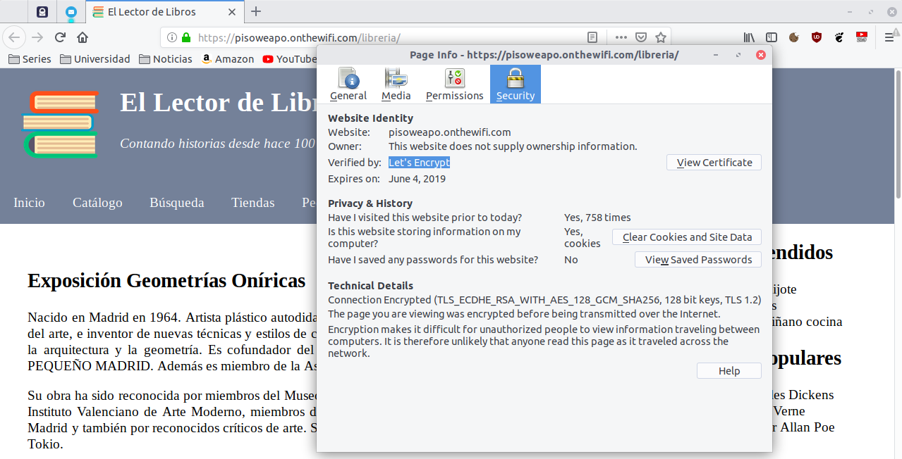

# Práctica 4. Asegurar la granja web

El objetivo de esta práctica es lelvar a cabo la configuración de seguridad de la granja web. Para ello, llevaremos a cabo las siguientes tareas:
- Instalar un certificado SSL para configurar el acceso HTTPS a los servidores
- Configurar las reglas del cortafuegos para proteger la granja web.

## Instalación del certificado SSL autofirmado para el acceso por HTTPS

Para ello tendremos que activar el módulo SSL de Apahce, generar los certificados y especificarle la ruta a los certificados en la condigueación. Para ello ejecutamos lo siguiente:

```bash
a2enmod ssl     #Activamos el modulo de ssl de apache2
servce apache2 restart
mkdir /etc/apache2/ssl
openssl req -x509 -nodes -days 365 -newkey rsa:2048 -keyout /etc/apache2/ssl/apache.key -out /etc/apache2/ssl/apache.crt
```



Tras esto editamos el archivo de configuración `/etc/apache2/sites-available/default-ssl.conf` y agregamos las siguientes líneas:
```bash
SSLCertificateFile /etc/apache2/ssl/apache.crt
SSLCertificateKeyFile /etc/apache2/ssl/apache.key
```
Activamos el sitio por defecto con `a2ensite default-ssl` y reiniciamos el servicio.

Si accedemos ahora desde un navegador directamente poniendo la ip de la máquina, accederemos al http por defecto, asi que para realizar la comprobación tenemos que escribir manualmente el https al comienzo.

Saldrá una ventana de riesgo ya que es un certificado autofirmado.



Tras esto habrá que copiar los archivos **.key** y **.crt** a las otras dos máquinas con el comando `scp *.key usuario@direccion-ip:/directorio`. En la máquina 2 se realizarán los mismos pasos que en la máquina anterior a partir de la modificación del default.ssl, y en la máquina 3 se añadirá en el archivo de configuración de nginx las siguientes líneas:



Comprobación del funcionamiento del http y del https accediendo al servidor:



Hay que tener en cuenta que la ip de 192.168.56.12 mostrada en el navegador, es la del balanceador de nginx.

## Configuración del cortafuegos

Ahora con el cortafuegos vamos a restringir los accesos para aumentar la seguridad de servicio que estamos ofreciendo. Para ello vamos a utilizar la herramienta **iptables**.

```bash
iptables -A INPUT -p tcp --dport 22 -j ACCEPT
iptables -A OUTPUT -p udp --sport 22 -j ACCEPT #Para aceptar la conexión ssh

iptables -A INPUT -m state --state NEW -p tcp --dport 80 -j ACCEPT
iptables -A INPUT -m state --state NEW -p tcp --dport 80 -j ACCEPT # HTTP y HTTPS
```

También está la opción de permitir el acceso con un único comando utilizando la opción multipuerto:

```
iptables -A INPUT -i eth0 -p tcp -m multiport --dports 22,80,443
    -m state --state NEW,ESTABLISHED -j ACCEPT

iptables -A OUTPUT -O eth0 -P tcp -m multiport --sports 22,80,443
    -m state --state ESTABLISHED -j ACCEPT
```

En este caso vamos a realizar un script que se ejecute al arranque de la máquina:



Con el comando `netstat -tulpn` visualizamos los puertos abiertos:



## Opcional

Para demostrar la instalación del certificado del certbot, adjunto una captura de pantalla de mi servidor realizado con una raspberry pi, utilizada como máquina de pruebas y de almacenamiento. La url es https://pisoweapo.onthewifi.com/libreria/

