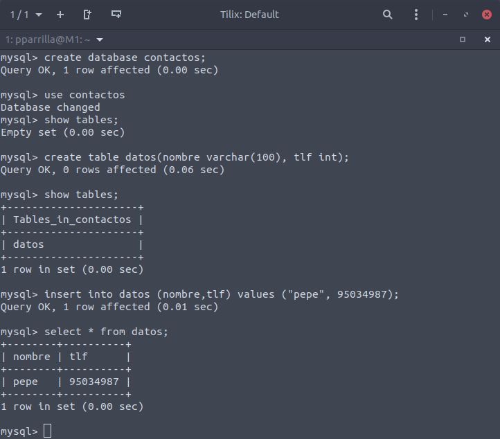
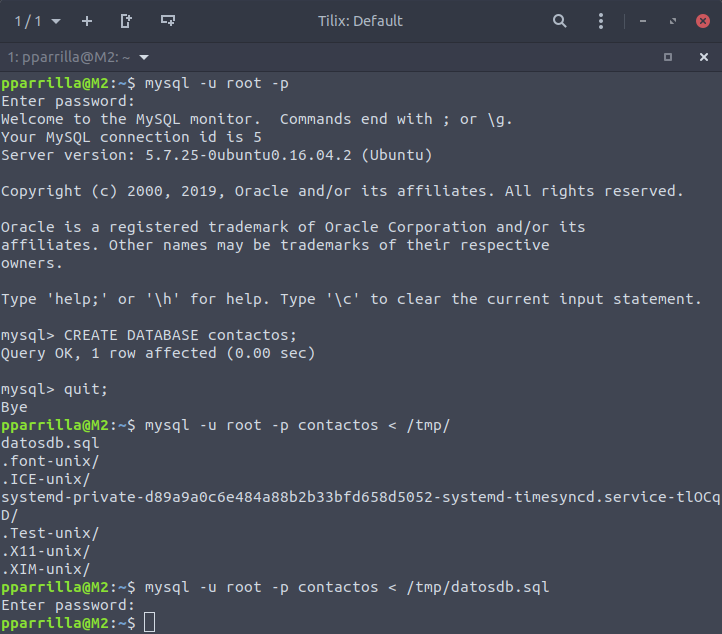
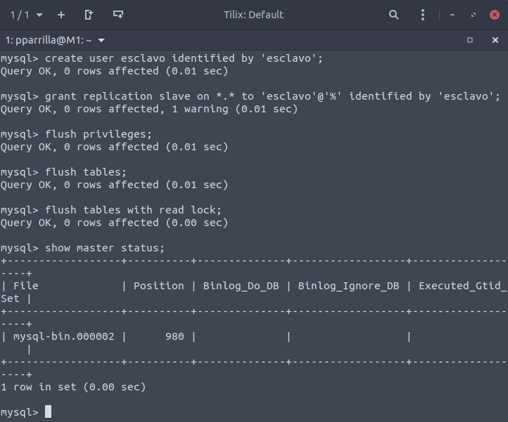
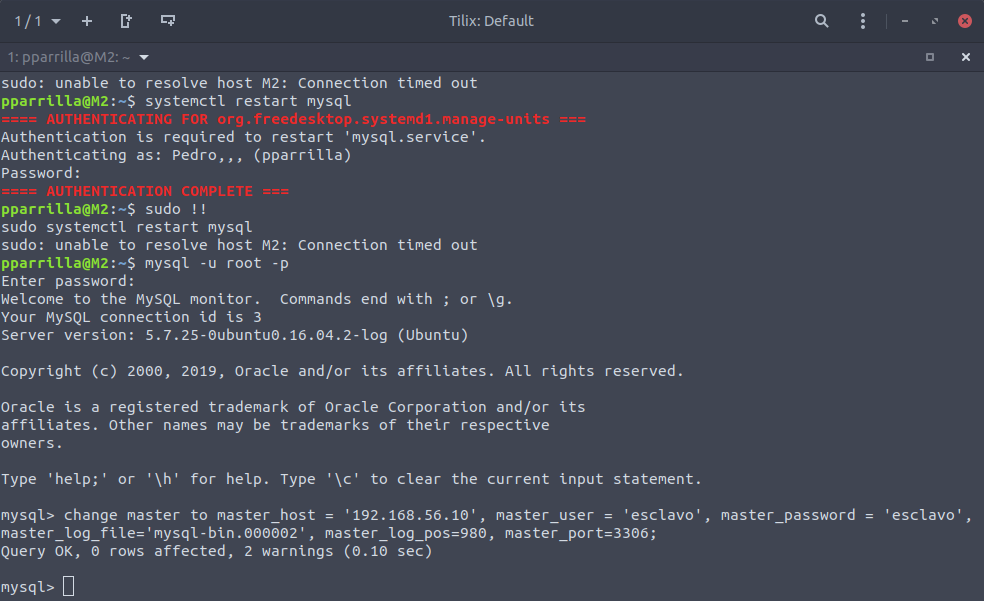
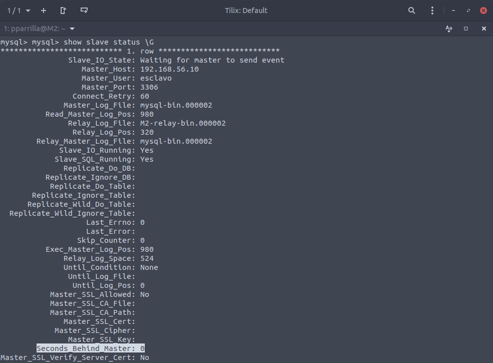

# Práctica 5. Replicación de bases de datos MySQL

Los objetivos concretos de esta práctica son:
- Copiar archivos de copia de seguridad mediante ssh
- Clonar manualmente BD entre máquinas
- Configurar la estructura maestro-esclavo entre dos máquinas para realizar el clonado automático de la información

Las tareas obligatorias a realizar son:
1. Crear una BD con al menos una tabla y algunos datos
2. Realizar la copia de seguridad de la BD completa usando mysqldump en la máquina principal y copiar el archivo de copia de seguridad a la máquina secundaria
3. Restaurar dicha copia de seguridad en la segunda máquina (clonado manual de la BD), de forma que en ambas máquinas esté esa BD de forma idéntica
4. Realizar la configuración maestro-esclavo de los servidores MySQL para que la replicación de datos se realice automáticamente

## Creación de BD con su tabla y algunos valores

Para acceder a mysql ejecutamos desde la terminal de la máquina

```bash
mysql -u root -p    # Y tras esto nos pedirá la contraseña
```

A continuación ejecutaríamos lo mostrado en la siguiente captura de pantalla:



## Replicar una BD MySQL con mysqldump

MySQL ofrece una herramienta para clonar las BD que tenemso en nuestra máquina. Esta herramienta es mysqldump. Para ver las diferentes opciones de mysqldump ejecutariamos `mysqldump --help`.

Antes de realizar cualquier copia tenemos que bloquear las tablas para que no se añadan cosas mientras esté en uso con `FLUSH TABLES WITH READ LOCK`. Tras esto ejecutariamos lo siguiente:

```bash
 mysqldump contactos -u root -p > /tmp/datosdb.sql  # Realiza la copia de la base de datos
 scp /tmp/datosdb.sql maquina2:/tmp/    # Introduciriamos la contraseña si no tenemos la key copiada
```

Ya tendriamos la copia en la máquina 2. Ahora habríá que desbloquear las tablas con `UNLOCK TABLES`.

## Restauración de dicha copia de seguridad en la segunda máquina

Para ello ejecutaríamos lo mostrado en la siguiente captura:



También podemos hacer la orden directamente usando un "pipe" a un  ssh para exportar los datos al mismo tiempo si se tiene creada la BD

```bash
mysqldump contactos -u root -p | ssh maquina2 mysql
```

## Replicación de BD mediante una configuración maestro-esclavo

La anterior configuración está muy bien, pero MySQL tiene la opción de configurar el demonio para hacer replicación de las BD sobre un esclavo a partir de los datos que almacena el maestro.

Primero nos vamos a la máquina que va a hacer de maestro (en mi caso la m1) y accedemos al fichero de configuración `/etc/mysql/mysql.conf.d/mysqld.cnf`. Tenemos que comentar donde pone `bin-address 127.0.0.1` y descomentar las líneas `server-id = 1` y `log_bin = /var/log...`

Tras esto guardamos el documento y reiniciamos el servicio. En la máquina 2 se realiza lo mismo exceptuando que `server-id = 2`.

Ahora si tuviesemos la version de mysql infrerior a 5.5 habría qeu indicar unos datos relativos al maestro en la configuración del esclavo, pero como no es el caso, nos quedamos en la máquina maestro y vamos a trabajar en mysql.



Ahora volvemos a la máquina esclava, entramos en mysql y le damos los datos del maestro.



Por último, volvemos al maestro y activamos las tablas para que puedan meterse nuevos datos en el maestro con `unlock tables`.

En el esclavo, para comprobar que todo funciona bien, mostramos lo siguiente. Si la variable `Seconds_Behind_Master` fuese null, sería por algún error. En mi caso es 0, por lo que todo funciona como debe:



## Cosas a tener en cuenta

Si os da error debido al UUID ya que la máquina 2 es un clonado de la máquina 1, y al ejecutar el comando `blkid`, podemos apreciar que tiene el mismo nombre. Con esto MySQL nos dará un error. Para solucionarlo, eliminamos el archivo auto.cnf

```bash
sudo rm /var/lib/mysql/auto.cnf
```