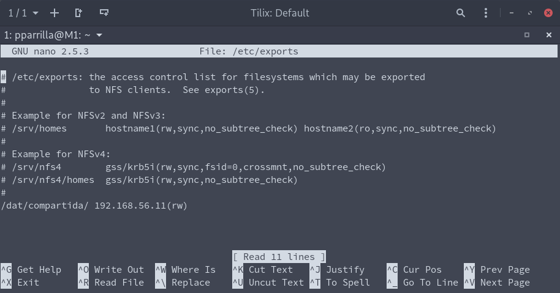
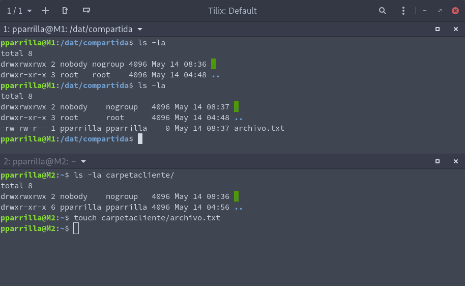
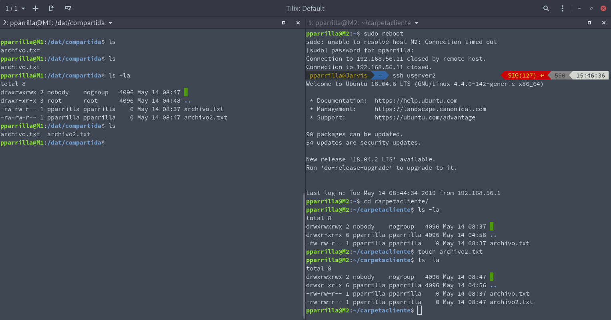

# Práctica 6. Servidor de disco NFS

El objetivo principal de esta práctica es configurar un servidor NFS para exportar un espacio en disco a los servidores finales (que actuarán como clientes-NFS).

Los objetivos concretos de esta práctica son:
- Configurar una máquina como servidor de disco NFS y exportar una carpeta a los clientes
- Montar en las máquinas cliente la carpeta exportada por el servidor
- Comprobar que la información que se escribe en una máquina en dicha carpeta se ve actualizada en el resto de máquinas que comparten ese espacio

Las tareas obligatorias a realizar son:
1. Configurar una máquina como servidor de disco NFS y exportar una carpeta a los clientes
2. Montar en las máquinas cliente la carpeta exportada por el servidor
3. Comprobar que todas las máquinas pueden acceder a los archivos almacenados enla carpeta compartida
4. Hacer permanente la configuración en los clientes para que monten automáticamente la carpeta compartida al arrancar el sistema

## Configurar el servidor NFS

Para ello ejecutamos lo siguiente

```bash
sudo apt-get install nfs-kernel-server nfs-common rpcbind

# Creamos la carpeta que vamos a compartir y cambiamos los permisos
sudo mkdir /dat/compartida
sudo chown nobofy:nogroup /dat/compartida/
sudo chmod -R 777 /dat/compartida/

# Modificamos el fichero /etc/exports
sudo nano /etc/exports
# Y añadimos
/dat/compartida 192.168.56.11(rw)

# Y finalmente reiniciamos el servicio
sudo service nfs-kernel-server restart
```



## Configuramos los clientes

Ahora lo voy a realizar en un cliente para realizaar la prueba:

```bash
sudo apt-get install nfs-common rpcbind

mkdir carpetacliente
chmod -R 777 carpetacliente

sudo mount 192.168.56.10:/dat/compartida carpetacliente
```



Ahi en la imagen se puede observar los cambios realizados, demostrando que está montado.

Para realizar la configuración permanente accedemos al fichero fstab y añadimos:

```
192.168.56.10:/dat/compartida /home/pparrilla/carpetacliente/   nfs auto,noatime,nolock,bg,nfsvers=3,intr,tcp,actimeo=1800 0 0
```

Aqui muestro que funciona:


