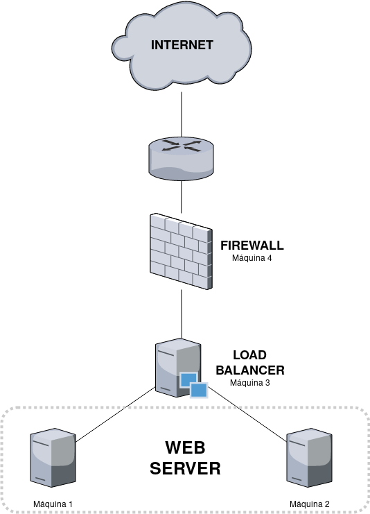

# Asegurar granja web y visualizador de logs

## Objetivos

En este trabajo se va a explicar la realización de un servicio web con la distribución mostrada en la siguiente imágen:



Como se puede observar, necesitamos 4 equipos para este proyecto a realizar. Para ello voy a utilizar para la 1 y 2 con Raspberry Pi con una imagen de Raspbian PS instalada. Para la 3 y 4 voy a utilizar mi ordenador, pasar por su cortafuegos y redireccionandolo al balanceador de carga.

Además de todo lo anterior, en mi ordenador (que actua como firewall y balanceador de carga) voy a instalar Elastic Stack para la visualización de logs en un entorno con diagramas y más visual para el mantenimiento y la detección de posibles errores en el sistema.

Este proyecto se va a centrar más en el posible uso y la potencia de Elastic Stack que en la realización del servicio, ya que se puede realizar mirando los guiones de prácticas anteriores, donde está muy bien explicado.

## Preparación del servicio

Para la preparación de las raspberry pi, he montado la imagen con el comando dd, y tras realizar la instalación, he instalado el paquete apache2 junto al de ssh para poder acceder a ellas de manera remota.

Para la instalación del balanceador de carga he utilizado nginx, explicado aqui:

- [Configuración del balanceador de carga NGINX](../practica3/README.md)

## Uso de certbot para la generación de certificados

Con la herramienta OpenSSL podemos generar certificados propios para las máquinas, lo único que cualquier usuario que acceda a nuestra web, a no ser que este verificado el certificado, le saldrá un warning similar al mostrado en la siguiente imagen:

- 

Para realizar esto de una forma más fácil voy a utilizar el paquete certbot. Para su instalación seguid los siguientes pasos (todo esto lo realizo en la máquina 1):

```bash

sudo add-apt-repository ppa:certbot/certbot # Añadimos el repositorio de certbot
sudo apt-get update
sudo apt-get install python-certbot-apache
sudo certbot --apache  #Ejecutamos el programa

```

Si realizais esto con máquinas virtuales, la instalación del certificado no funcionará ya que necesitan verificar de que es accesible y que hostea una página web dicha máquina, a no ser que esten conectadas directamente a la red.

Esto es debido a que fuera del ordenador que hostea las máquinas no es posible acceder a dichas direcciones ip.

Hay 2 opciones:
- Realizamos el redireccionamiento con iptables desde la Máquina 4 a la Máquina 1
- Instalamos el certificado en la Máquina 4

En mi caso como tenía instalado certbot en una Raspberry Pi que hostea una serie de servicios, he copiado la carpeta `/etc/letsencrypt`.

Para la copia se utiliza el comando rsync con la opcion -a para que copie los enlaces simbólicos.

Tras la copia, me he descargado de github letsencrypt y he realizado lo siguiente:

```bash
# Descargamos letsencrypt
git clone https://github.com/letsencrypt/letsencrypt
cd letsencrypt
./letsencrypt-auto install --apache --cert-path /etc/letsencrypt/live/pisoweapo.onthewifi.com/cert.pem --key-path
    /etc/letsencrypt/live/pisoweapo.onthewifi.com/privkey.pem --chain-path /etc/letsencrypt/live/pisoweapo.onthewifi.com/chain.pem
    --fullchain-path /etc/letsencrypt/live/pisoweapo.onthewifi.com/fullchain.pem

```

Tras esto ya tendremos el certificado en las dos máquinas, pero nos faltaría en el balanceador de carga y activarlo.

Este comando anterior sería el correcto y que funcionaría según muchos foros y documentación leída. En mi caso tras probarlo me daba un error de una comprobación de una clave al instalar paquetes de python, por lo que he optado por instalar certbot, generar un nuevo certificado y tras esto, copiar los archivos `*.pem` de una Raspberry pi a otra.

Ahora copiamos el `fullchain.pem` y el `privkey.pem` a la máquina que realiza de balanceador de carga para asignarselo en el fichero de configuración de nginx. Esto está explicado un poco en la [práctica 4](../practica4/README.md).

## Cortafuegos

Para la explicación de esto lo mejor es utilizar la documentación de la [práctica4](../practica4/README.md), donde se muestra al final un ejemplo de rechazo de todas las conexiones y aceptación de los puertos 80 y 443.

Como novedad, si no tuviese el balanceador y el firewall en la misma máquina, habría que utilizar los siguientes comandos para la redirección en el firewall:

```bash
sysctl net.ipv4.ip_forward=1    #Activamos el reenvío de peticiones
 iptables -t nat -A PREROUTING -p tcp --dport 80 -j DNAT --to-destination 192.168.1.122:80 #Reenvio lo que entre al puerto 80 a esa ip y ese puerto
 iptables -t nat -A POSTROUTING -j MASQUERADE   #Activa el enmascarado

```

Con `iptables -L` visualizaríamos que puertos están redireccionados y bloqueados.

## ELK Stack

ELK es el acrónimo de 3 herramientas open-source:
- **Elasticsearch**. Un buscador y un analizador de datos
- **Logstash**. Es un organizador de datos para agrupar todos los logs de los servicios para hacer la vida más fácil a Elasticsearch
- **Kibana**. Proporciona visualización de los datos con gráficas para facilitar su análisis.

En la siguiente imagen viene muy bien explicado 


Para la instalación de este paquete lo más fácil sería el uso de Docker, pero como no me percaté de la existencia de la imagen, los instalé directamente en el sistema (en mi portatil).

### Instalación ELK Stack

Para la instalación de las dependencias necesitamos deshabilitar Apache en el caso de que este activado o cambiar el pueto ya que necesitamos nginx.

Como Logstash no soporta Java 10, hay que utilizar java 8, que se puede instalar con el comando:

```bash
sudo apt install openjdk-8-jre apt-transport-https wget nginx
```

### Repositorios de Elastic

Ahora vamos añadir el repositorio de Elastic:

```bash
wget -q0 - https://artifacts.elastic.co/GPG-KEY-elasticsearch | sudo apt-key add -
```

Creamos el fichero `/etc/apt/sources.list.d/elastic.list` y pegamos la siguiente línea:
```
deb https://artifacts.elastic.co/packages/6.x/apt stable main
```

Realizas un `sudo apt update` y ya tenemos el repositorio de elastic instalado.

### Instalación de Elasticsearch y Kibana

Ahora realizamos la instalación con `sudo apt install elasticsearch kibana`.

Vas a necesitar configurar el fichero `/etc/kibana/kibana.yml` como en la siguiente captura de pantalla:


Y reinicias el servicio de kibana y elasticsearch.

### Configuración de Nginx

Para la configuración hace falta ejecutar en la terminal:

```
# Nota: admin puede ser sustituido por cualquier nombre de usuario y YourPassword también
echo "admin:`openssl passwd -apr1 YourPassword`" | sudo tee -a /etc/nginx/htpasswd.kibana

```

Ya va quedando menos para terminar la configuración básica para el ejemplo. Creamos el fichero `/etc/nginx/sites-available/kibana`. En él introducimos el siguiente texto:

```
server {
        listen 8080;    #Utilizad un puerto libre ya que el 80 y el 443 está dedicado al balanceador

        server_name your-site.com;

        auth_basic "Restricted Access";
        auth_basic_user_file /etc/nginx/htpasswd.kibana;

        location / {
            proxy_pass http://localhost:5601;
            proxy_http_version 1.1;
            proxy_set_header Upgrade $http_upgrade;
            proxy_set_header Connection 'upgrade';
            proxy_set_header Host $host;
            proxy_cache_bypass $http_upgrade;        
        }
    }
```
Ya los ultimos 4 comandos y veremos algo de interfaz:


```
# Eliminamos el default config y realizamos un enlace simbólico para Kibana
sudo rm /etc/nginx/sites-enabled/default
sudo ln -s /etc/nginx/sites-available/kibana /etc/nginx/sites-enables/kibana
# Reiniciamos nginx para qeu surja efecto
sudo systemctl restart nginx
# E instalamos logstash para finalizar
sudo apt install logstash
```

Ya podremos acceder con nuestro navegador al puerto designado y visualizar la interfaz web de Kibana.


## Diferentes usos para un analizador de logs

Como has podido observar, en esta última parte se le ha dado mucha importancia a la visualización de información de la forma más simple y rápida (es verdad, en una imagen se entiende todo más fácil que con mil líneas de código). Esta herramienta es muy usada en equipos de DevOps para obtención de notificaciónes cuando suceda algún evento respecto al aumento de tráfico o errores en el servicio.

Por los datos mostrados en la captura anterior, gracias al useragent de los navegadores podemos analizar también que tipo de sistemas acceden más al servicio, añadiendo la posibilidad de mejorar su interacción e interfaz con estos.

## Para finalizar...

En internet hay mucha documentación sobre como configurar el servicio de ELK para el análisis de datos, y lo van a explicar mejor que yo.

Como recomendaciones personales por si se quiere realizar un proyecto similar. 
1. Antes de montar ELK con diferentes sistemas, mejor probarlo en una máquina con Docker (preferible en un pc que no sea arm ya que aumenta la dificultad debido a la obtención de los paquetes). 
2. La obtención del certificado certbot es una pelea larga a no ser que sepas que tienes que hacer para repartir el certificado en el siguiente equipo
3. En el balanceador de carga no se porque no admite los certificados de certbot, si alguien sabe que habría que hacer agradecería que me lo comunicara a mi usuario de github o a mi correo personal, pedroparrilla@pm.me

# Conclusión

Hay muchas herramientas para asegurar nginx, siendo la más básica un cortafuegos con iptables, o la obtención de un certificado para una máquina con certbot.

También es muy importante comprobar el estado del servicio ya que es una buena manera de mantenimiento de la granja web por si se detecta cualquier actividad sospechosa, actuar rápidamente.